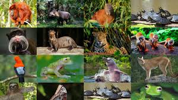

# Detection IA

Computer vision API and web interface for object detection using **FastAPI**, **YOLOv8** and **OpenCV**.

The project is container-ready and includes configuration for deployment workflows.

## Tech Stack

- Python
- FastAPI
- YOLOv8 / Ultralytics
- OpenCV
- NumPy
- Jinja2
- Docker
- Google Cloud Build / Cloud Run

## Features

- Object detection through a FastAPI backend
- YOLO-based inference
- Image processing with OpenCV
- Web interface rendered with Jinja2 templates
- Static asset support
- CORS configuration for frontend integration
- Dockerized deployment

## Project Structure

```text
app/
├── main.py
├── models/
├── routers/
└── utils/

static/
templates/
Dockerfile
cloudbuild.yaml
requirements.txt
```

## Installation

Create a virtual environment and install the dependencies:

```bash
python -m venv .venv
```

Activate it and run:

```bash
pip install -r requirements.txt
```

## Run Locally

```bash
uvicorn app.main:app --reload
```

Then open:

```text
http://localhost:8000
```

FastAPI interactive documentation is normally available at:

```text
http://localhost:8000/docs
```

## Deployment

The repository includes:

- `Dockerfile` for container builds
- `cloudbuild.yaml` for Google Cloud build/deployment workflows

## Example Asset



---

**Author:** Miguel Martínez
